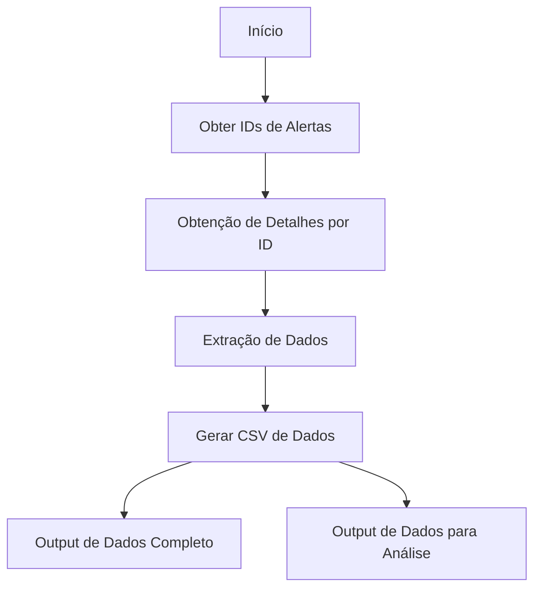

# Sistema de Monitoramento de Compliance


Sistema de simulação para monitoramento de alertas de compliance via API.

*Pré Requisitos:*

- Python 3.8+
- Bibliotecas: pandas, requests

*Estruturação do Código:*

<div align="justify">
  
O código foi realizado com o intuito de gerar uma estrutura de recebimento de dados separados por IDs de Alertas. Inicialmente foi criado uma classe para receber a API Interna, seguida por uma função para receber os dados de uma API pública. 

No entanto, por ser uma simulação, as APIs utilizadas não são reais, e para realizar a simulação extração de dados, foi implementado duas classes que geram dados seguindo o sistema de filtragem por ID, sendo elas a **FakeInternalAPI** e **FakePublicAPI**, onde é gerado aleatoriamente 100 linhas de dados.

Para a classe principal, foi criado uma função para gerar um novo diretório relacionado a data na qual o código está sendo executado, com a finalidade de armazenar os outputs de dados via CSV. Após a geração dos dados randômicos, dois arquivos CSV são criados, sendo eles separados por dados gerados e análise realizada. O nome do arquivo é formatado para ser gerado com sua data e hora de execução.

Exemplo:
```compliance_alerts_dados_20250715_154411``` e
```compliance_alerts_analise_20250715_154411```

Para a análise dos dados, foi implementado alguns tipos de contagens filtradas por **Tipo de Alerta**, **Status** e **Nível de Impacto**, onde é realizado a contagem total de alertas por cada filtro, além de sua porgentagem.

Por fim, o output esperado após a execução do script é um log de execução, e uma pasta com dois arquivos CSV:

- Log e Pasta gerados:


<p> </p>

- Arquivos CSV:


<p> </p>

*Output de log esperado:*
```
2025-07-15 15:44:11,527 - INFO - Diretório criado: c:\(Seu_Usuario)\GitHub\compliance-monitoring-system\Compliance 20250715
2025-07-15 15:44:11,528 - INFO - Iniciando extração de 100 alertas...
2025-07-15 15:44:11,528 - INFO - Progresso: 10/100 alertas processados
2025-07-15 15:44:11,528 - INFO - Progresso: 20/100 alertas processados
2025-07-15 15:44:11,529 - INFO - Progresso: 30/100 alertas processados
2025-07-15 15:44:11,529 - INFO - Progresso: 40/100 alertas processados
2025-07-15 15:44:11,529 - INFO - Progresso: 50/100 alertas processados
2025-07-15 15:44:11,530 - INFO - Progresso: 60/100 alertas processados
2025-07-15 15:44:11,530 - INFO - Progresso: 70/100 alertas processados
2025-07-15 15:44:11,530 - INFO - Progresso: 80/100 alertas processados
2025-07-15 15:44:11,531 - INFO - Progresso: 90/100 alertas processados
2025-07-15 15:44:11,531 - INFO - Progresso: 100/100 alertas processados
2025-07-15 15:44:11,531 - INFO - Extração concluída. 100 alertas obtidos com sucesso.
2025-07-15 15:44:11,568 - INFO - Dados salvos com sucesso em: c:\(Seu_Usuario)\GitHub\compliance-monitoring-system\Compliance 20250715\compliance_alerts_dados_20250715_154411.csv
2025-07-15 15:44:11,568 - INFO - Análise exploratória salva em: c:\(Seu_Usuario)\GitHub\compliance-monitoring-system\Compliance 20250715\compliance_alerts_analise_20250715_154411.csv
2025-07-15 15:44:11,569 - INFO - Processo concluído com sucesso!

```


</div>

# Diagrama de Solução



# Desafios


